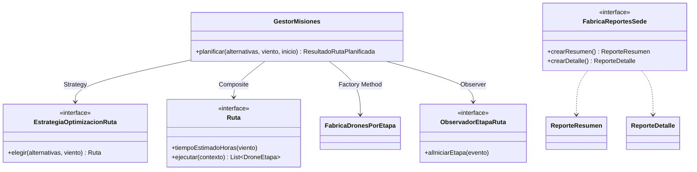
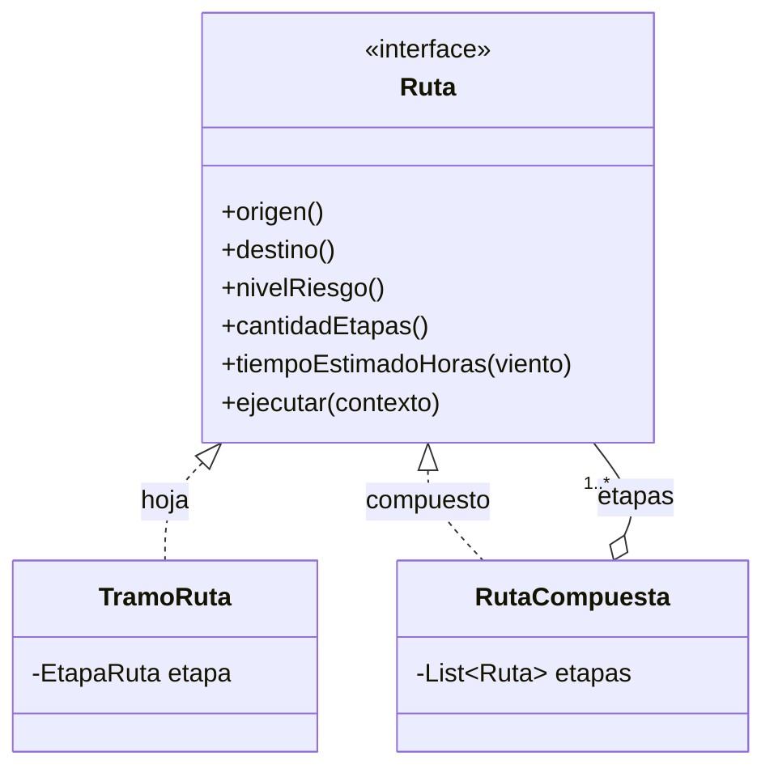
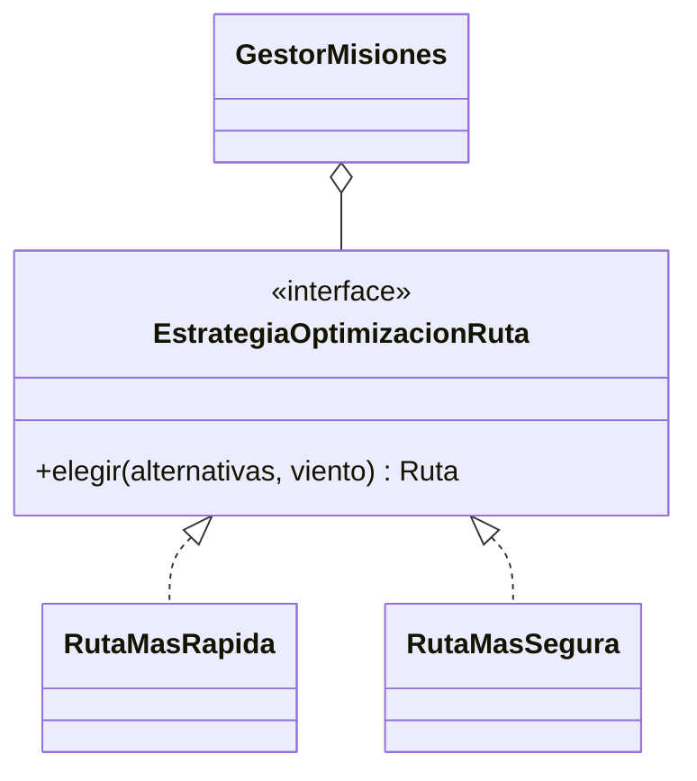
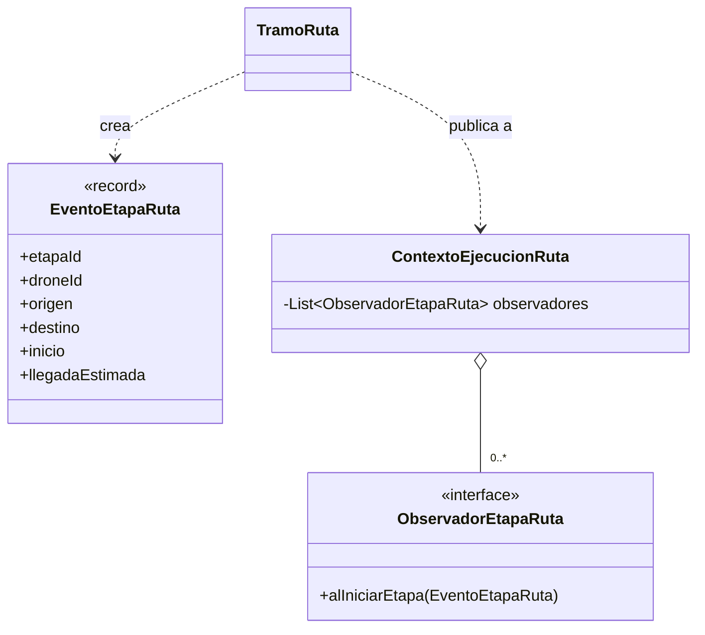
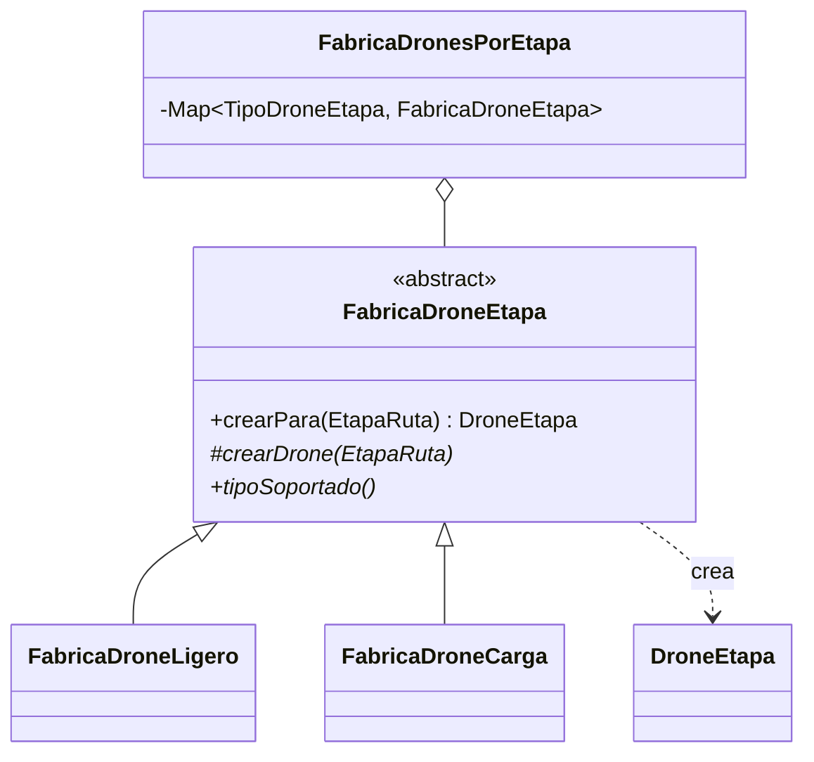
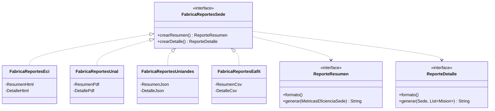

# 03 · Arquitectura de rutas multi-etapa con patrones combinados

Código: [`skycampus-enterprise`](../skycampus-enterprise), paquetes `routing` y `reporting`. Cinco patrones: los cuatro que pide el reto (Composite, Strategy, Observer, Factory Method) y el Abstract Factory del problema 2.

## Vista de conjunto

El flujo: `GestorMisiones` recibe rutas alternativas → la **estrategia** elige una → la ruta elegida (simple o **compuesta**) se ejecuta tramo a tramo → cada tramo pide su drone a la **fábrica** de su tipo → al iniciar cada tramo se avisa a los **observadores**. Los reportes de cada sede salen de su **fábrica abstracta**.

---

## 1. Composite · rutas simples y multi-etapa

**Implementación.** `TramoRuta` es un tramo A → B. `RutaCompuesta` guarda una lista de `Ruta` (tramos u otras compuestas): valida que cada etapa empiece donde terminó la anterior, suma tiempos, toma el riesgo máximo y ejecuta sus etapas en orden, desplazando la hora de inicio de cada una.

**Por qué este y no otro.** El requisito es que `GestorMisiones` calcule y ejecute igual "ECI → UNAL" y "ECI → estación 116 → Uniandes". Composite da exactamente eso: un solo tipo `Ruta` y recursión. Alternativas descartadas:
- *Lista simple de tramos*: el gestor tendría que distinguir "una ruta" de "varias" y no se podría anidar (p. ej. un trayecto con dos recargas dentro de una ruta mayor).
- *Decorator*: agrega comportamiento a un objeto, no compone varios en un todo.
- Cuándo **no** usarlo: si las rutas nunca superaran un nivel, bastaría una lista con herencia.

## 2. Strategy · criterio de optimización

**Implementación.** `RutaMasRapida` minimiza tiempo (desempate: riesgo, luego ID); `RutaMasSegura` minimiza riesgo (desempate: tiempo, luego ID). El gestor recibe la estrategia por constructor.

**Por qué este y no otro.** El criterio cambia según la misión (una urgente prefiere rapidez; un equipo frágil, seguridad) y se configura desde fuera. Alternativas descartadas:
- *`if/switch` en el gestor*: cada criterio nuevo obliga a editar el gestor (viola OCP).
- *Template Method*: fija el esqueleto por herencia; aquí no hay un algoritmo común con pasos que varíen, son criterios de comparación completos e intercambiables en ejecución.

## 3. Observer · alertas por etapa

**Implementación.** Al ejecutar un tramo se crea un `EventoEtapaRuta` con la llegada estimada y se entrega a cada observador del contexto. Las pruebas usan un observador que acumula eventos y comprueban un aviso por tramo, en orden.

**Por qué este y no otro.** Los consumidores (panel de la sede, alerta al coordinador, registro) cambian y pueden ser varios; el tramo no debe conocerlos. Alternativas descartadas:
- *Llamada directa al panel*: acopla el tramo a una pantalla concreta.
- *Mediator*: centraliza la conversación entre muchos colegas; aquí la comunicación es en un solo sentido (de la ruta hacia los interesados).

## 4. Factory Method · drone correcto por etapa

**Implementación.** `crearPara` es el método plantilla común (valida la etapa, delega en `crearDrone` y comprueba que el drone soporte la carga). Cada subclase decide qué drone crear. `FabricaDronesPorEtapa` indexa las fábricas por tipo, así que el gestor no tiene `switch` y una fábrica duplicada se rechaza.

**Por qué este y no otro.** Cada etapa declara el tipo que necesita (un tramo largo con carga requiere `CARGA`), y lo único que varía es *un* producto. Alternativas descartadas:
- *Constructor directo (`new DroneEtapa(...)`) en el tramo*: reparte la regla de capacidad por todo el código.
- *Abstract Factory*: sobra, porque no hay una familia de productos relacionados, solo el drone.
- *Builder*: útil para objetos con muchos parámetros opcionales; `DroneEtapa` tiene tres obligatorios.

## 5. Abstract Factory · reportes por sede

**Implementación.** Dos productos distintos: el **resumen** recibe las métricas del reto 01 (`MetricasEficienciaSede`) y el **detalle** la lista de misiones de la sede. Cada fábrica concreta crea sus dos productos como clases propias (anidadas y privadas, para que nadie mezcle familias):

| Sede | Familia | Resumen | Detalle |
|---|---|---|---|
| ECI | HTML (panel web) | `<section>` con indicadores, texto escapado | `<table>` una fila por misión |
| UNAL | PDF (archivo imprimible) | PDF 1.4 de una página | PDF 1.4 con una línea por misión |
| Uniandes | JSON (su dashboard) | objeto con `null` si no hay entregas | arreglo de misiones |
| EAFIT | CSV `;` (hoja de cálculo) | encabezado + fila | encabezado + filas, con comillas si hace falta |

`FabricaReportesPorSede.para("UNAL")` entrega la fábrica de la sede; el cliente solo ve las interfaces.

**Por qué este y no otro.** El problema no es crear *un* objeto sino garantizar que el resumen y el detalle de una sede salgan **del mismo formato**: una familia coherente. Alternativas descartadas:
- *Factory Method por producto*: habría dos jerarquías independientes y nada impediría combinar un resumen HTML con un detalle PDF.
- *Strategy de "formateador" con un `enum`*: las cuatro salidas no comparten estructura (PDF necesita tabla de referencias cruzadas; CSV, escape de `;`), así que cada producto merece su clase.
- Cuándo **no** usarlo: con una sola sede o un solo tipo de reporte bastaría una fábrica simple. Agregar una quinta universidad es una fábrica nueva y una entrada en el mapa (prueba `agregarUnaSedeSoloRequiereRegistrarSuFabrica`).

---

## Singleton: por qué no se usa

La flota compartida y la lista de observadores son estado mutable usado desde varias sedes. Un Singleton lo haría global, difícil de aislar en pruebas y propenso a carreras. Todas las dependencias se inyectan por constructor.

## Verificación

Desde `Infernape/skycampus-enterprise`, ejecutar `mvn verify`. Las pruebas de `routing` y `reporting` cubren rutas simples y compuestas, continuidad entre etapas, las dos estrategias y sus desempates, el drone por tipo de etapa, un evento por tramo, las cuatro familias de reportes (contenido exacto, escape y PDF con `xref` válido) y entradas inválidas.
