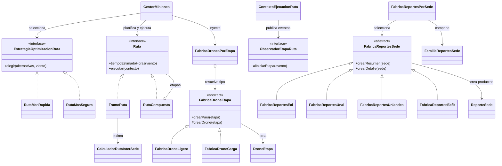

# 03 · Arquitectura Enterprise con patrones

## Diagrama

## Patrones implementados

| Patrón | Implementación | Motivo y efecto |
|---|---|---|
| Composite | `Ruta`, `TramoRuta`, `RutaCompuesta` | Una ruta simple y una multietapa comparten contrato. `GestorMisiones` calcula y ejecuta ambas sin ramificarse por tipo. El compuesto valida continuidad, suma tiempos y propaga ejecución a sus etapas. |
| Strategy | `EstrategiaOptimizacionRuta`, `RutaMasRapida`, `RutaMasSegura` | El criterio de optimización cambia por inyección. Agregar otro criterio no exige editar el gestor. Los empates se resuelven por riesgo y luego por ID. |
| Observer | `ObservadorEtapaRuta`, `EventoEtapaRuta`, `ContextoEjecucionRuta` | Al iniciar cada tramo se publica su llegada estimada a cero o más observadores. El tramo no conoce si el consumidor es un panel, una alerta o un registro. |
| Factory Method | `FabricaDroneEtapa`, `FabricaDroneLigero`, `FabricaDroneCarga` | Cada etapa declara el tipo requerido; una fábrica concreta crea el drone correspondiente y valida su capacidad de carga. `FabricaDronesPorEtapa` resuelve la fábrica por tipo sin `switch` en el gestor. |
| Abstract Factory | `FabricaReportesSede` y fábricas por sede | Cada fábrica crea la familia coherente resumen/detalle. ECI usa HTML, UNAL PDF, Uniandes JSON y EAFIT CSV. Añadir una familia nueva consiste en agregar su fábrica y registrarla. |

## Cuándo no usar estos patrones

- **Composite:** una ruta de una sola etapa, sin posibilidad real de composición, puede ser un objeto simple.
- **Strategy:** si solo existe un algoritmo estable y no se espera intercambiarlo, una función directa es más sencilla.
- **Observer:** si hay un único consumidor fijo y no se necesita desacoplar eventos, una llamada directa puede ser suficiente.
- **Factory Method:** con un solo tipo de drone, una construcción directa evita clases sin variación real.
- **Abstract Factory:** si solo existe una familia o un único producto de reporte, una fábrica sencilla es suficiente.
- **Singleton:** no se usa para la flota ni para los observadores; el estado mutable compartido complica pruebas y concurrencia. Las dependencias se inyectan.

## Verificación

Desde `Infernape/skycampus-enterprise`, ejecutar `mvn verify`. Los escenarios comprueban rutas simples y compuestas, continuidad, optimización por rapidez y seguridad, drone por tipo de etapa, alertas por tramo, familias de reporte por sede y entradas inválidas.

Resultado local: 53 pruebas aprobadas; JaCoCo reporta 99,7 % de líneas y 97,5 % de ramas, sobre mínimos configurados de 85 % y 75 %.
