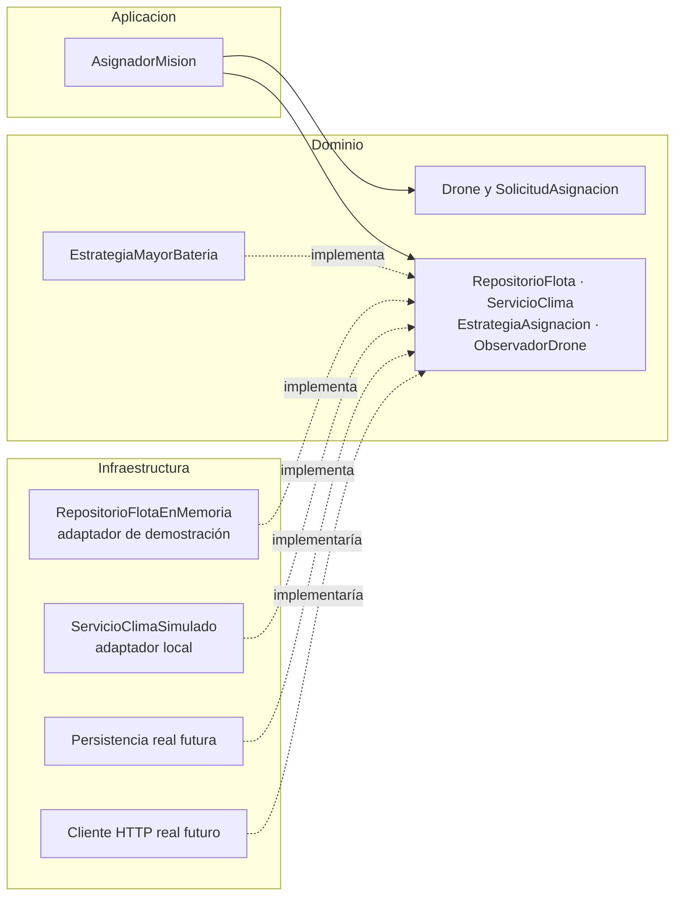

# 04 · Arquitectura por capas y SOLID

## Objetivo

`AsignadorMision` implementa el caso de uso de asignación sin conocer una base de datos, una API meteorológica ni una clase concreta de estrategia. El módulo queda organizado en tres capas y usa inversión de dependencias.

## Diagrama



## Responsabilidades y decisiones

- **Dominio:** `Drone` y `SolicitudAsignacion` (ambos usan el record `Sede`, igual que `Mision`), las reglas de selección y los puertos que expresan lo que necesita el caso de uso. No importa Spring, JPA, Mockito ni clientes HTTP; sus imports externos se limitan al JDK.
- **Aplicación:** `AsignadorMision` valida la solicitud, consulta clima y flota a través de puertos, descarta drones no disponibles o con capacidad insuficiente, delega la elección, registra y notifica. Recibe todas las dependencias por constructor.
- **Infraestructura:** contiene adaptadores sustituibles. Los incluidos (`RepositorioFlotaEnMemoria`, `ServicioClimaSimulado`) son implementaciones locales de demostración; no simulan una integración de producción ni hacen llamadas externas. En producción se conectarían aquí los adaptadores JPA/HTTP.
- La asignación urgente solo puede elegir candidatos `express` por medio de `EstrategiaMayorBateria`; para misiones normales elige la mayor batería. El caso de uso no conoce esos criterios.
- Si el clima es adverso, no consulta la flota. Si no hay candidatos o la estrategia no elige, no persiste ni notifica. La aplicación también rechaza una estrategia defectuosa que devuelva un drone fuera de los candidatos.

## Pruebas

| Clase de prueba | Capa | Qué demuestra |
|---|---|---|
| `AsignadorMisionTest` (8) | Aplicación, **solo Mockito** | `@Mock` para los 4 puertos e `@InjectMocks`. Asignación exitosa (registra y notifica EN_VUELO); clima adverso sin tocar flota, estrategia ni notificador (`verifyNoInteractions`); drones ocupados o sin capacidad descartados antes de la estrategia; estrategia sin selección; estrategia defectuosa que devuelve un drone no candidato (`IllegalStateException`, sin registrar ni notificar); solicitud y dependencias nulas. |
| `EstrategiaMayorBateriaTest` (4) | Dominio | NORMAL elige la mayor batería; URGENTE solo considera EXPRESS aunque un normal tenga más; URGENTE sin EXPRESS no elige; empate por ID menor. |
| `DroneYSolicitudTest` | Dominio | Validaciones de `Drone` y `SolicitudAsignacion`; `noDisponible()` conserva los demás datos. |
| `AdaptadoresInfraestructuraTest` (4) | Infraestructura | El repositorio en memoria filtra por sede y disponibilidad, marca el drone asignado y no permite asignarlo dos veces; el clima simulado aplica su regla. |
| `AsignadorMisionConAdaptadoresTest` (2) | Las 3 capas | El mismo `AsignadorMision` funciona con adaptadores reales locales en vez de mocks, sin cambiar una línea de aplicación (DIP en la práctica). |
| `ArquitecturaCapasTest` (2) | Regla de capas | Lee los fuentes: `domain` solo importa `java.*`; `application` solo `java.*` y `domain`. Si alguien importa Spring, Mockito o un adaptador, la prueba falla. |

Ninguna prueba abre conexiones, usa una base de datos ni hace llamadas HTTP. `mockito-junit-jupiter` tiene alcance `test`; Mockito no entra al código de producción.

```sh
cd Infernape/skycampus-enterprise
mvn verify
```

Evidencia: [`evidencia/mvn_verify.txt`](evidencia/mvn_verify.txt).

## SOLID en este diseño

- **S:** `AsignadorMision` solo orquesta el caso de uso; elegir drone es de la estrategia, guardar es del repositorio, avisar es del observador.
- **O:** una nueva política (p. ej. menor uso) es otra `EstrategiaAsignacion`; el caso de uso no cambia.
- **L:** cualquier `RepositorioFlota` (memoria o JPA) cumple el mismo contrato; las pruebas con adaptadores reales lo comprueban.
- **I:** cada puerto tiene uno o dos métodos que el caso de uso sí usa.
- **D:** la aplicación depende de interfaces del dominio; la infraestructura las implementa. `ArquitecturaCapasTest` impide la dependencia inversa.
