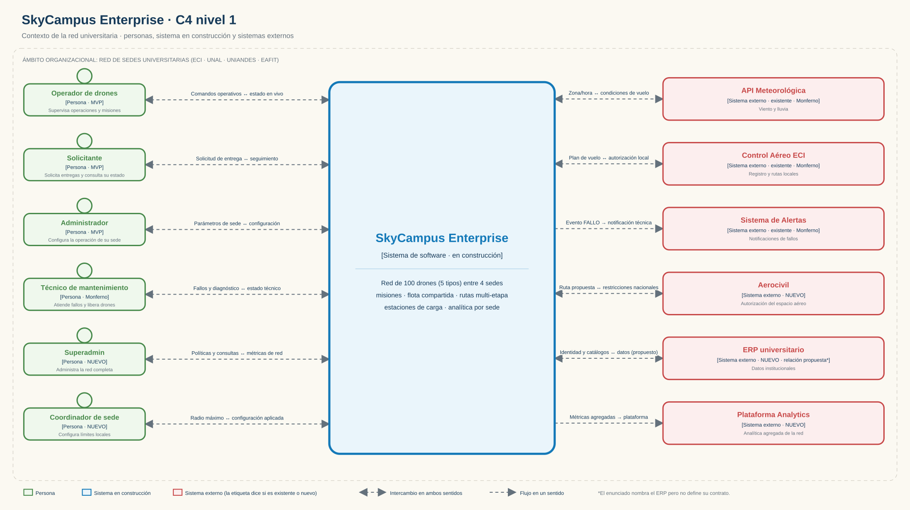
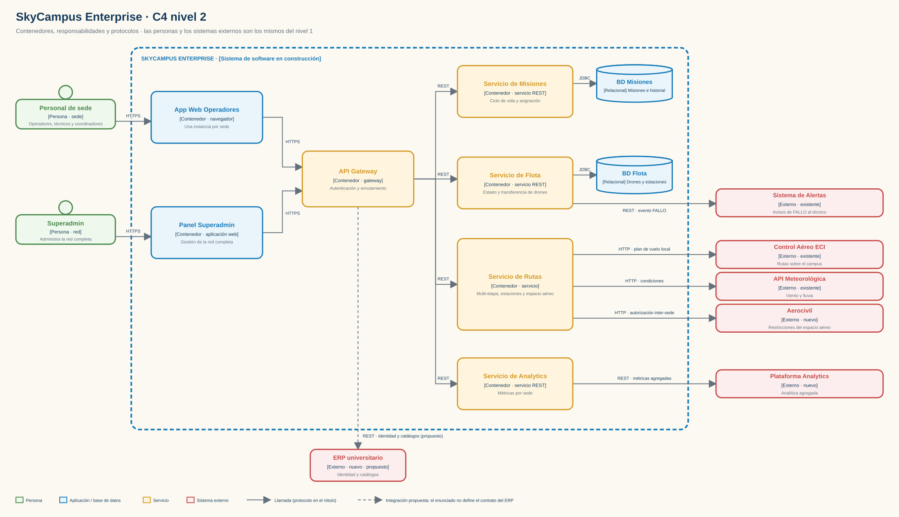
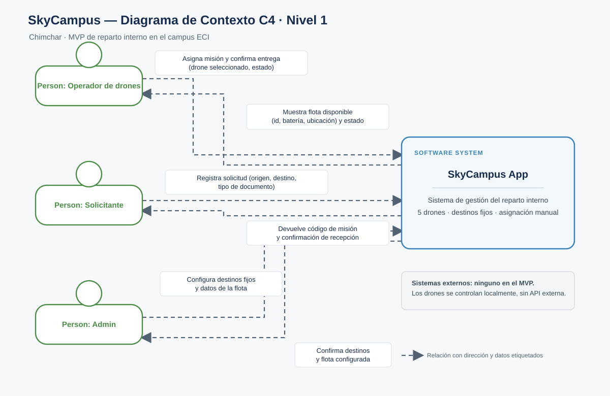

# 05 · C4 de SkyCampus Enterprise

## Entregables

- [`SkyCampus_Enterprise_C4.drawio`](SkyCampus_Enterprise_C4.drawio): documento editable de diagrams.net con cuatro páginas: contexto aprobado de Chimchar, contexto aprobado de Monferno, contexto Enterprise (nivel 1) y contenedores Enterprise (nivel 2). Los dos diagramas previos se conservan para comparar la evolución en un solo documento.
- [`Contexto_Enterprise_Nivel_1.svg`](Contexto_Enterprise_Nivel_1.svg): exportación legible del sistema, sus personas y los sistemas externos.
- [`Contenedores_Enterprise_Nivel_2.svg`](Contenedores_Enterprise_Nivel_2.svg): exportación de los contenedores, responsabilidades y protocolos.
- [`Contexto_Chimchar.svg`](Contexto_Chimchar.svg) y [`Contexto_Monferno.svg`](Contexto_Monferno.svg): exportaciones de referencia, copiadas sin cambios desde los retos aprobados.
- [`gen_c4.py`](gen_c4.py): generador local de los SVG Enterprise y del archivo draw.io. Ejecutar desde esta carpeta con `python gen_c4.py`.

## Nivel 1 · Contexto Enterprise



El sistema en construcción (azul) ocupa el centro; las 6 personas (verde, cabeza circular) a la izquierda y los 6 sistemas externos (rojo) a la derecha. Cada caja queda a la altura de un tramo del sistema, así que todas las relaciones son líneas rectas que no se cruzan y cada rótulo se lee sobre fondo limpio. La etiqueta de cada caja dice si viene del MVP, de Monferno o si es nueva en Enterprise. Doble punta = intercambio en ambos sentidos; una punta = flujo saliente (Alertas y Analytics).

**Sistemas externos:** se conservan la API Meteorológica, el Control Aéreo ECI y el Sistema de Alertas de Monferno; Enterprise agrega Aerocivil, la plataforma Analytics y el ERP universitario. El enunciado nombra el ERP pero no define su contrato, así que su relación se marca como **propuesta** (*). Control Aéreo ECI se mantiene separado de Aerocivil: el primero autoriza rutas sobre el campus y la segunda impone las restricciones nacionales del espacio aéreo para vuelos inter-sede.

## Nivel 2 · Contenedores



La frontera azul discontinua es SkyCampus Enterprise. Afuera quedan las mismas personas y sistemas externos del nivel 1, ahora conectados al contenedor concreto que los usa:

| Desde | Hacia | Protocolo | Para qué |
|---|---|---|---|
| Personal de sede / Superadmin | App Web Operadores / Panel Superadmin | HTTPS | Operación por sede y administración de la red |
| Las dos aplicaciones | API Gateway | HTTPS | Punto único de entrada, autenticación |
| API Gateway | Misiones, Flota, Rutas, Analytics | REST | Enrutamiento interno |
| Misiones / Flota | BD Misiones / BD Flota | JDBC | Persistencia propia de cada servicio |
| Servicio de Flota | Sistema de Alertas | REST | Evento de FALLO de un drone (en Monferno lo emite `GestorFlota`) |
| Servicio de Rutas | Control Aéreo ECI, API Meteorológica, Aerocivil | HTTP | Plan local, condiciones y autorización inter-sede |
| Servicio de Analytics | Plataforma Analytics | REST | Métricas agregadas por sede |
| API Gateway | ERP universitario | REST (propuesto, discontinua) | Identidad institucional y catálogos de las sedes |

Las líneas son ortogonales y los cuatro servicios cuelgan de un solo bus desde el Gateway, de modo que ninguna línea atraviesa una caja. Colores: aplicaciones y bases de datos en azul, servicios en ámbar, externos en rojo.

## Comparación de los contextos

Los tres diagramas de contexto están juntos en el archivo draw.io multipágina; aquí se ven las versiones aprobadas Chimchar y Monferno junto a Enterprise:

### Chimchar · MVP



Tres personas (Operador, Solicitante y Admin) usan SkyCampus. El MVP no integra sistemas externos y la operación de los drones permanece local.

### Monferno · v2


Se conserva el sistema central y los tres roles originales; se suma el Técnico de mantenimiento y aparecen API Meteorológica, Control Aéreo ECI y Sistema de Alertas.

### Infernape · Enterprise

El diagrama de nivel 1 de arriba conserva esos cuatro roles y las tres integraciones de v2 (también en el nivel 2, conectadas al servicio que las usa). Suma Superadmin y Coordinador de sede, y añade Aerocivil, ERP universitario y plataforma Analytics. El nivel 2 descompone el mismo sistema central en sus aplicaciones, Gateway, servicios y bases de datos.

## Qué evolucionó, qué se mantuvo y cómo se controla la complejidad

| Aspecto | Chimchar · MVP | Monferno · v2 | Infernape · Enterprise |
|---|---|---|---|
| Personas | 3: Operador, Solicitante, Admin | 4: se agrega Técnico | 6: se agregan Superadmin y Coordinador de sede |
| Sistemas externos | Ninguno | 3: Clima, Control Aéreo ECI, Alertas | Se conservan esos 3 y se agregan Aerocivil, ERP y Analytics |
| Descomposición | Una caja de sistema | Una caja de sistema | Nivel 1 conserva una caja; nivel 2 muestra apps, Gateway, servicios y datos |
| Alcance | Operación local del campus | Automatización y mantenimiento | Red multi-sede, coordinación central, rutas inter-sede y analítica |
| Dependencias | Ninguna integración externa | Clima, control y alertas | Más contratos externos y separación por responsabilidad |

**Qué creció:** la cantidad de roles, universidades y sistemas con los que se intercambian datos. En nivel 2 también crece el número de partes desplegables y responsabilidades técnicas. Cada integración externa agrega un contrato y una posible falla que el diseño debe manejar.

**Qué se mantuvo:** SkyCampus sigue siendo un único sistema de software desde la perspectiva de contexto; el Operador, Solicitante y Admin conservan su propósito y los colores de notación siguen la guía de clase: personas verdes, sistema en alcance azul/amarillo y sistemas externos rojos. Enterprise amplía el contexto sin presentar cada microservicio como un sistema independiente en el nivel 1.

**Cómo se conserva la coherencia:** el nivel 1 limita el detalle a usuarios, sistema y relaciones externas; el nivel 2 abre el sistema y asigna responsabilidades a contenedores con protocolos rotulados. Las integraciones propuestas o aún sin contrato (ERP) quedan identificadas como supuestos, no como hechos confirmados.

## Regenerar

Desde `Infernape/05 · Diagrama de Contexto C4`, ejecutar:

```sh
python gen_c4.py
```

El generador reutiliza las fuentes aprobadas que están en la raíz Chimchar y en `Monferno/05 · Diagrama de Contexto C4`.
