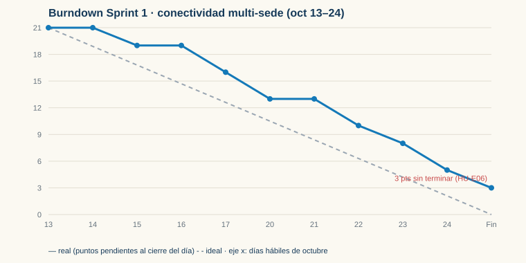

# 09 · Roadmap de SkyCampus Enterprise — 3 sprints con métricas

Trimestre de entrega de la red multi-sede: **3 sprints de 2 semanas** (13 oct – 21 nov 2026). Equipo: Kevin y Angel. Las HU-E01…HU-E12 son las de la [matriz del reto 06](../06%20·%20RF%20y%20RNF/README.md); HU-E13…HU-E15 son trabajo adicional del roadmap que no es RF de la matriz. Estimación Fibonacci (1, 2, 3, 5, 8).

## Roadmap

| Sprint | Fechas | Objetivo | HU seleccionadas (puntos) | Puntos | Velocity usada para planificar |
|---|---|---|---|---:|---|
| **1** | 13–24 oct | **Conectividad multi-sede básica**: crear misiones en las 4 sedes por la API y asignar el drone correcto | HU-E13 Registrar las 4 sedes y su estado (3) · HU-E01 Registrar misión inter-sede (5) · HU-E02 Asignar por prioridad (5) · HU-E06 Rechazo con motivo (3) · HU-E11 Dominio sin frameworks (3) · HU-E12 Puerta de cobertura (2) | 21 | 20 (referencia: Sprint 1 de Monferno, 19 de 20) |
| **2** | 27 oct – 7 nov | **Rutas multi-etapa + estaciones de carga** | HU-E06 Rechazo con motivo, arrastre (3) · HU-E04 Autorización Aerocivil (5) · HU-E05 Ruta multi-etapa con estaciones (8) · HU-E09 Límites Aerocivil 120 m (2) | 18 | **18** = lo entregado en el Sprint 1 ("yesterday's weather") |
| **3** | 10–21 nov | **Analytics + panel superadmin** | HU-E07 Analytics por sede (5) · HU-E14 Panel superadmin de la red (5) · HU-E08 Reportes por formato (3) · HU-E03 Radio por coordinador (3) · HU-E15 Suspender/activar sede (2) · HU-E10 Rendimiento 100 drones (2) | 20 | 19,5 ≈ 20 = promedio de S1 real (18) y S2 si cumple su compromiso tras la retro (21 de capacidad) |

**Demo de cada Sprint Review:** S1 — misión ECI → UNAL asignada por la API; S2 — ruta ECI → estación 116 → Uniandes en el simulador, con rechazo de la Aerocivil; S3 — dashboard del superadmin con la eficiencia de las 4 sedes.

## Ceremonias

| Ceremonia | Qué pasa en SkyCampus Enterprise | Duración |
|---|---|---|
| Sprint Planning | Se toma el objetivo del roadmap, se eligen HU hasta la velocity, se estiman y se asigna responsable por módulo (Kevin: API y persistencia; Angel: dominio, rutas y analítica). | 2 h |
| Daily Scrum | ¿Qué hice? ¿Qué haré? ¿Impedimento? Una ronda por persona. | 15 min |
| Sprint Review | Demo del objetivo del sprint sobre el simulador y actualización del backlog. | 1 h |
| Retrospectiva | 3 cosas que salieron bien, 3 a mejorar, compromisos con responsable y fecha. | 45 min |

## Sprint 1 simulado: métricas

| Métrica | Valor |
|---|---|
| Comprometido | 21 puntos (6 HU) |
| Terminado (cumple DoD) | 18 puntos (5 HU) |
| No terminado | HU-E06 (3): los 5 motivos de rechazo estaban en el dominio, pero faltaban las pruebas del endpoint → no cumple DoD, pasa al Sprint 2 |
| Velocity real | **18** |
| Predictibilidad | 18 / 21 = 86 % |

Lectura del burndown: los dos primeros días quedan planos (montaje de Spring Boot + H2 y acuerdos de API); del día 3 al 9 baja al ritmo ideal; termina en 3 puntos porque HU-E06 quedó sin pruebas de integración. Se regenera con `python gen_burndown.py`.

## Retrospectiva del Sprint 1

**Salió bien**
1. Separar dominio y aplicación de Spring desde el primer día: los cambios de JPA no rompieron ninguna prueba del caso de uso, y `ArquitecturaCapasTest` detectó un import indebido antes del merge.
2. El orden de validación acordado en planning (sede → clima → Aerocivil → flota) evitó retrabajo en la HU de asignación.
3. La puerta de JaCoCo (85/75) en `mvn verify` mantuvo la cobertura sobre 95 % sin discusiones al final.

**A mejorar**
1. Montar Spring Boot + H2 tomó dos días que no estaban estimados: el burndown quedó plano al inicio.
2. Una HU (HU-E06) se dio por "casi lista" sin pruebas del endpoint: la DoD se revisó tarde.
3. Los PR esperaron hasta un día por revisión, lo que concentró los merges al final del sprint.

**Compromisos**

| # | Compromiso | Responsable | Fecha límite |
|---|---|---|---|
| 1 | Crear una tarea técnica estimada para cualquier configuración de infraestructura nueva (estaciones de carga, cliente de la Aerocivil) en el Sprint Planning. | Kevin | 27 oct 2026 (planning del Sprint 2) |
| 2 | Revisar la DoD en la daily de la mitad del sprint para cada HU "en progreso" y mover a "Hecho" solo con pruebas de integración en verde. | Angel | 31 oct 2026 |
| 3 | Responder todo PR en menos de 4 horas hábiles; si no es posible, avisar en la daily. | Kevin y Angel | Desde el 27 oct 2026; se mide en la retro del 7 nov |
