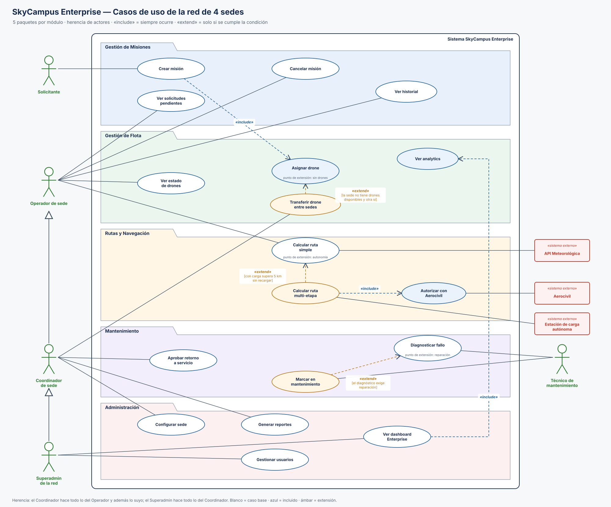

# 10 · Casos de uso de SkyCampus Enterprise en 5 paquetes

Archivos: [`Diagrama_Casos_Uso_Enterprise.svg`](Diagrama_Casos_Uso_Enterprise.svg), [`Diagrama_Casos_Uso_Enterprise.drawio`](Diagrama_Casos_Uso_Enterprise.drawio) (editable) y [`gen_cu.py`](gen_cu.py), que genera ambos desde una sola especificación y **verifica que ninguna línea atraviese un caso de uso** (`python gen_cu.py` imprime `cruces línea/caso: ninguno`).

## Cómo leerlo en 30 segundos (para alguien no técnico)

- La caja grande es el sistema; cada carpeta de color es un **módulo**.
- Las personas en verde usan el sistema; las cajas rojas son **otros sistemas** con los que se habla (clima, Aerocivil, estaciones de carga).
- Una línea simple = "esta persona hace esto".
- Flecha con triángulo hueco = "**también es**": el Coordinador también es Operador (hace todo lo que hace un Operador y algo más), y el Superadmin también es Coordinador.
- Flecha punteada azul «include» = "**siempre** pasa también"; flecha punteada ámbar «extend» = "**a veces** pasa, solo si se cumple lo que dice entre corchetes".

## Paquetes y casos

| Paquete | Casos de uso | Quién |
|---|---|---|
| Gestión de Misiones | Crear misión, Ver solicitudes pendientes, Cancelar misión, Ver historial | Solicitante (crear), Operador |
| Gestión de Flota | Ver estado de drones, Asignar drone, Transferir drone entre sedes, Ver analytics | Operador, Coordinador (transferir), Superadmin (vía dashboard) |
| Rutas y Navegación | Calcular ruta simple, Calcular ruta multi-etapa, Autorizar con Aerocivil | Operador; API Meteorológica, Aerocivil y Estación de carga (sistemas externos) |
| Mantenimiento | Diagnosticar fallo, Marcar en mantenimiento, Aprobar retorno a servicio | Técnico de mantenimiento, Coordinador (aprobar retorno) |
| Administración | Configurar sede, Gestionar usuarios, Ver dashboard Enterprise, Generar reportes | Coordinador (sede y reportes), Superadmin (usuarios y dashboard) |

## Herencia de actores

| Hijo → padre | Qué significa | Por qué |
|---|---|---|
| Coordinador de sede → Operador de sede | El coordinador puede hacer todo lo del operador en su sede, además de transferir drones, configurar la sede, generar reportes y aprobar el retorno a servicio. | El coordinador supervisa la operación de su sede; repetir sus 6 líneas al operador saturaría el diagrama. |
| Superadmin de la red → Coordinador de sede | El superadmin puede hacer todo lo del coordinador (en cualquier sede), además de gestionar usuarios y ver el dashboard de la red. | Es el nivel más alto: administra las 4 sedes. |

El Técnico **no** hereda del Operador: atiende drones en FALLO pero no despacha misiones.

## «include» (siempre ocurre)

| Base → incluido | Justificación |
|---|---|
| Crear misión → Asignar drone | Toda misión creada se asigna automáticamente (RF-11); no existe una misión sin intento de asignación. |
| Calcular ruta multi-etapa → Autorizar con Aerocivil | Ninguna ruta inter-sede se planifica sin autorización (RF-13, regla RN-4 de SC-15). |
| Ver dashboard Enterprise → Ver analytics | El dashboard de la red siempre muestra la eficiencia de cada sede (RF-16); analytics también existe por separado en Flota. |

## «extend» (solo con condición)

| Extensión → base | Condición | Punto de extensión |
|---|---|---|
| Transferir drone entre sedes → Asignar drone | La sede no tiene drones disponibles y otra sede sí. | *sin drones* |
| Calcular ruta multi-etapa → Calcular ruta simple | Con carga, el trayecto supera 5 km sin recargar (RN-1). | *autonomía* |
| Marcar en mantenimiento → Diagnosticar fallo | El diagnóstico concluye que hay que reparar. | *reparación* |

**Por qué *multi-etapa* es extensión de *simple*:** el operador siempre pide "calcular ruta"; solo cuando la distancia con carga no cabe en un vuelo, el sistema amplía el cálculo con estaciones intermedias. Así *multi-etapa* también incluye la autorización de la Aerocivil (RF-13) y se conecta con la Estación de carga.

## Coherencia con los otros retos

- Los nombres de los casos son los del enunciado; RF-10…RF-17 del [reto 06](../06%20·%20RF%20y%20RNF/README.md) apuntan a estos casos.
- SC-15 del [reto 07](../07%20·%20Plantilla%20DOSW/README.md) detalla *Calcular ruta multi-etapa* con su «include» a la Aerocivil.
- Los sistemas externos son los del C4 del [reto 05](../05%20·%20Diagrama%20de%20Contexto%20C4/README.md); la Estación de carga autónoma aparece aquí como actor nuevo de Enterprise.
