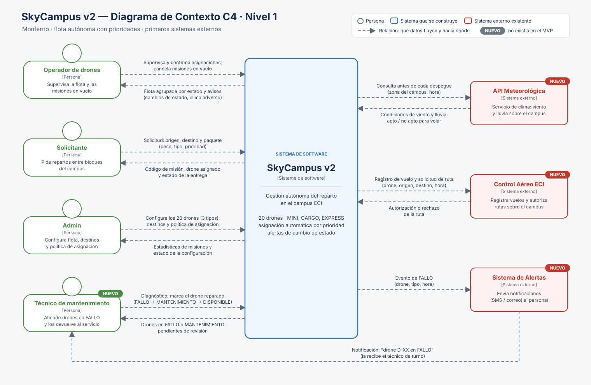

# 05 · Diagrama de Contexto C4 — Monferno (SkyCampus v2)

C4 nivel 1: el sistema que se construye, las personas que lo usan y los sistemas externos con los que habla.

| Archivo | Contenido |
|---|---|
| [`Diagrama_Contexto_SkyCampus_v2.drawio`](Diagrama_Contexto_SkyCampus_v2.drawio) | Fuente editable con **dos páginas**: "Contexto v2 (Monferno)" y "Contexto MVP (Chimchar)", para comparar en el mismo documento |
| [`Diagrama_Contexto_SkyCampus_v2.svg`](Diagrama_Contexto_SkyCampus_v2.svg) | Exportación de la v2 |
| [`Diagrama_Contexto_SkyCampus_MVP.svg`](Diagrama_Contexto_SkyCampus_MVP.svg) y [`.drawio`](Diagrama_Contexto_SkyCampus_MVP.drawio) | El diagrama del MVP (reto 05 de Chimchar), copiado sin cambios para que la carpeta sea autocontenida |
| [`gen_c4.py`](gen_c4.py) | Genera, desde una sola especificación, el SVG y el `.drawio` completo: la página v2 con las flechas **ancladas a sus cajas** (al mover una caja en draw.io, las flechas y sus etiquetas la siguen) y la página MVP, que lee de `Diagrama_Contexto_SkyCampus_MVP.drawio`. Uso: `python gen_c4.py` desde esta carpeta; no necesita nada de fuera |

## Notación (la de la clase, basada en c4model.com)

| Elemento | Color | Uso en el diagrama |
|---|---|---|
| Persona | Verde, con cabeza circular | Operador, Solicitante, Admin, Técnico de mantenimiento |
| Sistema que se construye | Azul | SkyCampus v2 |
| Sistema externo que ya existe | Rojo | API Meteorológica, Control Aéreo ECI, Sistema de Alertas |
| Relación | Flecha discontinua | La punta indica hacia dónde van los datos; la etiqueta dice **qué** datos |

Cada caja lleva su nombre, su tipo entre corchetes y una línea que dice qué es. Las etiquetas "NUEVO" marcan lo que no existía en el MVP.

## SkyCampus v2

### Relaciones con los sistemas externos

Son la regla clave del reto: qué fluye y en qué dirección.

| Sistema externo | Dirección | Datos |
|---|---|---|
| API Meteorológica | SkyCampus → API | Consulta antes de cada despegue (zona del campus, hora) |
| | API → SkyCampus | Condiciones de viento y lluvia: apto / no apto para volar |
| Control Aéreo ECI | SkyCampus → Control | Registro de vuelo y solicitud de ruta (drone, origen, destino, hora) |
| | Control → SkyCampus | Autorización o rechazo de la ruta |
| Sistema de Alertas | SkyCampus → Alertas | Evento de FALLO (drone, tipo, hora) |
| | Alertas → Técnico | Notificación "drone D-XX en FALLO" al técnico de turno |

**Sentido de la flecha del Sistema de Alertas.** El enunciado lo marca "Sistema de Alertas ←—", igual que la API. Aquí la flecha sale de SkyCampus porque sigue el **flujo del dato**: el evento de FALLO nace en SkyCampus, va al Sistema de Alertas y de ahí al técnico.

### Estado objetivo frente a lo que ya existe en el código

El diagrama muestra el **estado objetivo de la v2**: los contratos que se acordarían con cada sistema externo. El código de `skycampus-v2` implementa una parte:

| Elemento del diagrama | En el código hoy | Falta (ver la trazabilidad del reto 06) |
|---|---|---|
| Consulta al clima "(zona del campus, hora)" | `ApiMeteorologica.esApto()` sin parámetros, simulada con Mockito (reto 12) | Enviar la zona y la hora; timeout y falla segura (RNF-05) |
| Evento de FALLO "(drone, tipo, hora)" | El observador `AlertaTecnico` genera la orden con el id y el tipo (reto 03) | La hora del fallo y la integración con el Sistema de Alertas real (RF-05) |
| Control Aéreo ECI | No existe | Todo: registro de vuelo y autorización de ruta |
| Operador: "cancela misiones en vuelo" | No existe | Requisito por definir; lo pide la Ley de Fitts del reto 08 (botón de emergencia) |
| Técnico: FALLO → MANTENIMIENTO → DISPONIBLE | `EstadoDrone.puedePasarA` y `Drone.transicionarA` | La interfaz del técnico (RF-06) |

## Comparación: MVP (Chimchar) frente a v2 (Monferno)

| Aspecto | MVP (Chimchar) | v2 (Monferno) |
|---|---|---|
| Personas | 3: Operador, Solicitante, Admin | **4**: se suma el **Técnico de mantenimiento** |
| Sistemas externos | **Ninguno**: los drones se controlan localmente | **3**: API Meteorológica, Control Aéreo ECI, Sistema de Alertas |
| Relaciones | 6, todas entre personas y el sistema | **14**: 8 con personas, 5 con sistemas externos y 1 de un externo a una persona (Alertas → Técnico) |
| Flota | 5 drones, asignación **manual** | 20 drones de 3 tipos, asignación **automática** por prioridad |
| Lo que ve el Operador | Flota disponible (id, batería, ubicación) | Flota **agrupada por estado** y avisos de cambio de estado |
| Lo que envía el Solicitante | Origen, destino, tipo de documento | Origen, destino y **paquete con peso y prioridad** |

**Qué creció:**
- **La frontera del sistema se abrió.** El MVP era una caja cerrada; la v2 depende de terceros para decidir si vuela (el clima), si puede tomar una ruta (control aéreo) y cómo avisa (alertas). Cada flecha roja es un punto de fallo nuevo que hay que simular en las pruebas y manejar en los requisitos (reto 06, RNF de disponibilidad).
- **Hay un rol nuevo con su propio ciclo.** El técnico cierra el ciclo FALLO → MANTENIMIENTO → DISPONIBLE, que en el MVP no existía.
- **Los datos se enriquecieron.** El paquete ahora tiene peso y prioridad, porque la asignación automática depende de ellos.

**Qué se mantuvo:**
- El sistema central es **uno solo** (SkyCampus).
- Los tres actores originales y su propósito son los mismos: el Solicitante pide, el Operador supervisa y el Admin configura.
- Se mantienen los colores de la clase (persona verde, sistema azul) y la regla de etiquetar cada flecha con datos y dirección. El diagrama del MVP se conserva **sin tocar**, como fue aprobado en Chimchar. Por eso conserva convenciones que la v2 mejoró: rótulos en inglés ("Person:", "SOFTWARE SYSTEM"), cajas sin tipo entre corchetes ni descripción, y flechas que se cruzan. En la v2 cada caja lleva nombre, tipo y descripción, y las flechas son paralelas, sin cruces.
- El nivel de detalle sigue siendo C4 nivel 1: no se muestran contenedores ni clases internas (el Strategy y el Observer viven dentro de la caja azul).
