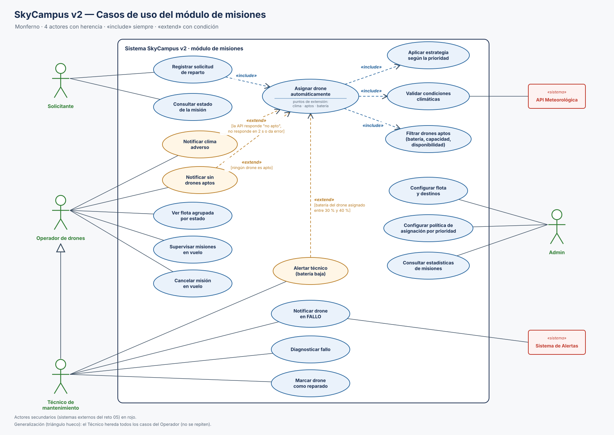

# 10 · Diagrama de casos de uso — Monferno (módulo de misiones v2)

| Archivo | Contenido |
|---|---|
| [`Diagrama_Casos_Uso_Misiones_v2.drawio`](Diagrama_Casos_Uso_Misiones_v2.drawio) | Fuente editable en draw.io. Las 24 relaciones están ancladas a sus actores y casos de uso |
| [`Diagrama_Casos_Uso_Misiones_v2.svg`](Diagrama_Casos_Uso_Misiones_v2.svg) | Exportación vectorial |
| [`gen_cu.py`](gen_cu.py) | Genera el SVG y el `.drawio` desde una sola especificación. Uso: `python gen_cu.py` desde esta carpeta |

## Actores y herencia

| Actor | Casos de uso propios |
|---|---|
| **Solicitante** | Registrar solicitud de reparto · Consultar estado de la misión |
| **Operador de drones** | Ver flota agrupada por estado · Supervisar misiones en vuelo · Cancelar misión en vuelo · recibe "Notificar clima adverso" y "Notificar sin drones aptos" |
| **Técnico de mantenimiento** → generalización hacia Operador | Diagnosticar fallo · Marcar drone como reparado · recibe "Notificar drone en FALLO" y "Alertar técnico (batería baja)" |
| **Admin** | Configurar flota y destinos · Configurar política de asignación por prioridad · Consultar estadísticas de misiones |

**Herencia de actores.** El Técnico se une al Operador con una **generalización**: línea continua y triángulo hueco hacia el Operador, sin nombre, como manda UML. Así **hereda** todos los casos del Operador (ver la flota, supervisar y cancelar misiones, recibir los avisos de asignación) y además tiene los suyos de mantenimiento. Los casos heredados **no se repiten** como asociaciones del Técnico.

**Actores secundarios** (sistemas externos del reto 05, en rojo, «sistema»):
- **API Meteorológica**: responde a "Validar condiciones climáticas".
- **Sistema de Alertas**: entrega "Notificar drone en FALLO". Es el único contrato que tiene con SkyCampus en el reto 05: el evento de FALLO (drone, tipo, hora).

El **Control Aéreo ECI** del reto 05 no aparece porque la autorización de ruta no tiene requisito en el reto 06 ni paso en SC-07. Es estado objetivo, fuera de este módulo.

## «include»: comportamiento que se ejecuta **siempre**

| Caso base | «include» | Por qué es obligatorio | Paso de SC-07 |
|---|---|---|---|
| Registrar solicitud de reparto | Asignar drone automáticamente | En la v2, toda solicitud registrada dispara la asignación automática | paso 1 |
| Asignar drone automáticamente | Validar condiciones climáticas | No se vuela sin verificar el clima. Siempre (RF-04) | paso 3 |
| Asignar drone automáticamente | Filtrar drones aptos | Ninguna estrategia elige fuera de los aptos: disponible, batería ≥ 30 % y tipo compatible | paso 4 |
| Asignar drone automáticamente | Aplicar estrategia según la prioridad | Siempre se aplica una estrategia; lo que cambia es **cuál**: URGENTE → la más rápida (RF-08); NORMAL y BAJO → la de mayor batería (RF-07) | paso 5 |

La flecha del «include» va **del caso base al incluido**: el base no está completo sin él.

## «extend»: comportamiento opcional **con condición**

| Extensión | Caso base · punto de extensión | **Condición** | Requisito / SC-07 | ¿Implementado? |
|---|---|---|---|---|
| Notificar clima adverso | Asignar drone · clima | `[la API responde "no apto", no responde en 2 s o da error]` | RF-04, RNF-05 · FA-2 y FA-4 | **Parcial**: no despega, pero el aviso con motivo y el timeout no existen |
| Notificar sin drones aptos | Asignar drone · aptos | `[ningún drone es apto]` | RF-07 · FA-1 | **Parcial**: no asigna, pero no avisa el motivo |
| Alertar técnico (batería baja) | Asignar drone · batería | `[batería del drone asignado entre 30 % y 40 %]` | RF-09 (Could Have) · FA-5 | **No**: `AlertaTecnico` solo reacciona a FALLO |

La flecha del «extend» va **de la extensión al caso base**. El caso base funciona solo y la extensión se inserta en su punto de extensión únicamente si se cumple la condición. "Asignar drone automáticamente" declara sus tres puntos de extensión dentro de la elipse, bajo la línea: clima, aptos y batería.

## Decisiones

- **"Notificar drone en FALLO" es un caso de uso propio, no una extensión.** Lo dispara el evento del sistema: un drone pasa a FALLO, `GestorFlota` notifica al observador `AlertaTecnico` (reto 03) y el Sistema de Alertas avisa al técnico, **sin que el operador intervenga** (RF-05). Si fuera un «extend» de "Supervisar misiones", el aviso dependería de que el operador estuviera supervisando, y eso contradice RF-05.
- **Elegir la estrategia no es una extensión.** Siempre ocurre (paso 5 de SC-07), así que es un «include». Modelarla como «extend» "solo si es URGENTE" dejaba fuera la regla de NORMAL y BAJO.
- **"Cancelar misión en vuelo"** sale de la Ley de Fitts del reto 08 (botón de emergencia grande). Todavía no tiene RF propio en el reto 06.

## Coherencia entre retos

| Reto | Cómo encaja |
|---|---|
| 05 (contexto) | Los mismos actores y sistemas externos; el Sistema de Alertas solo transporta el evento FALLO, igual que en el contexto |
| 06 (RF/RNF) | Cada «include» y cada «extend» remite a su RF/RNF (tablas de arriba) |
| 07 (SC-07) | "Asignar drone automáticamente" con sus cuatro «include» es el flujo básico de SC-07. Las tres extensiones son los flujos alternos FA-1, FA-2/FA-4 y FA-5; FA-3 (peso > 2000 g) es un rechazo del caso base |

## Diferencias con Chimchar

| | Chimchar (SC-01) | Monferno (módulo de misiones v2) |
|---|---|---|
| Actores | 3, sin herencia | 4 personas con generalización **Técnico → Operador**, y 2 sistemas externos |
| Asignación | Manual | Automática, con «include» de clima, aptitud y estrategia |
| «include» / «extend» | 1 / 1 | **4 / 3**, cada «extend» con su condición, su punto de extensión y su estado de implementación |
