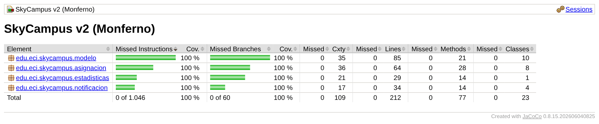
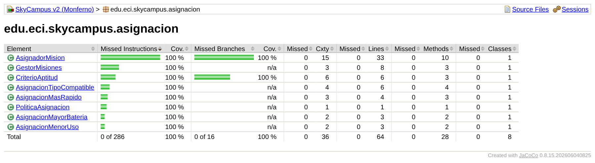

# 13 · JaCoCo — Cobertura de código (Monferno)

Proyecto analizado: [`skycampus-v2`](../skycampus-v2), que reúne el código de los retos 01, 03, 04 y 12 de Monferno.

## 1. Quality Gate de cobertura en el build (JaCoCo)

El "Quality Gate con 80 % line y 70 % branch" que pide el reto es la regla `check` de JaCoCo en el build. El Quality Gate de SonarQube ("Sonar way") es otra cosa: no tiene condición de ramas y solo evalúa el código nuevo (ver reto 14).

En el [`pom.xml`](../skycampus-v2/pom.xml), JaCoCo 0.8.15 hace tres cosas:

| Ejecución | Fase | Qué hace |
|---|---|---|
| `prepare-agent` | antes de `test` | Instrumenta las pruebas y deja el agente en `argLine` |
| `report` | `test` | Genera `target/site/jacoco/` (HTML, XML para Sonar y CSV) |
| `check` | `verify` | **Rompe el build** si la cobertura baja de los umbrales |

```xml
<limit><counter>LINE</counter><value>COVEREDRATIO</value><minimum>0.80</minimum></limit>
<limit><counter>BRANCH</counter><value>COVEREDRATIO</value><minimum>0.70</minimum></limit>
```

Así, la v2 **no llega a producción** si baja del 80 % de líneas o del 70 % de ramas.

**Evidencia de que la puerta se cierra.** Se ejecutó `mvn clean verify -Dtest=ModeloTest -Dsurefire.failIfNoSpecifiedTests=false`, que corre solo las pruebas del modelo, sin tocar el código. La cobertura cae a cerca del 33 % de líneas y del 25 % de ramas, y el build termina en `BUILD FAILURE` con "Coverage checks have not been met": [`evidencia/jacoco_check_rojo.txt`](evidencia/jacoco_check_rojo.txt).

El agente de Mockito (Byte Buddy) también se carga con `-javaagent` mediante `@{argLine}`, así que convive con el agente de JaCoCo (ver reto 12).

## 2. Resultado de JaCoCo

Commit `6769a21`, ejecución `mvn clean verify sonar:sonar` del 09/10/2026 ([`evidencia/sonar_despues.txt`](evidencia/sonar_despues.txt)), que es la que generó el reporte HTML. También la ejecución previa sin Sonar ([`evidencia/correcciones_verify.txt`](evidencia/correcciones_verify.txt)) dio 114 pruebas y "All coverage checks have been met":

| Métrica | Valor | Umbral |
|---|---|---|
| Pruebas | 114 ejecutadas, 0 fallos, 0 errores | — |
| Instrucciones | 100 % (1046 de 1046) | — |
| **Líneas** | **100 % (212 de 212)** | ≥ 80 % ✅ |
| **Ramas** | **100 % (60 de 60)** | ≥ 70 % ✅ |
| Regla `check` | "All coverage checks have been met" | — |

| Paquete | Líneas | Ramas | Clases |
|---|---|---|---|
| `modelo` | 85/85 | 24/24 | 10 |
| `asignacion` | 64/64 | 16/16 | 8 |
| `estadisticas` | 29/29 | 14/14 | 1 |
| `notificacion` | 34/34 | 6/6 | 4 |





Las capturas se renderizaron desde el reporte HTML real de `target/site/jacoco`. Los datos verificables están en [`evidencia/jacoco.csv`](evidencia/jacoco.csv).

**El 100 % no significa "probado al 100 %".** La cobertura solo dice qué líneas se ejecutaron. En el reto 12, con 100 % de cobertura, todavía sobrevivían 3 mutantes: había reglas que se ejecutaban pero que ninguna prueba verificaba. Por eso, en el reto 12 se hicieron pruebas de mutación manuales (scripts `mutantes_12*.ps1`) como complemento de JaCoCo. No forman parte del build: integrar una herramienta como PIT sería el siguiente paso.

## 3. SonarQube: antes y después

Para analizar con SonarQube (Community Build v26.9, local):

```
cd Monferno\skycampus-v2
mvn clean verify sonar:sonar
```

El token va solo en la variable de entorno `SONAR_TOKEN`, nunca en el repositorio. El proyecto en Sonar es `skycampus-v2` ("SkyCampus v2 (Monferno)"). Sonar importa el XML de JaCoCo para la cobertura.

| Métrica (Overall Code) | Antes (`507a8bc`) | Después (`6769a21`) | Meta del reto |
|---|---|---|---|
| Seguridad (vulnerabilidades) | 0 · A | 0 · A | 0 ✅ |
| Confiabilidad (bugs) | **1 · C** | 0 · A | 0 ✅ |
| Mantenibilidad (code smells) | 2 · A | 0 · A | — |
| Deuda técnica | 15 min | **0 min** | < 30 min ✅ |
| Cobertura | 100 % | 100 % | ≥ 80 % ✅ |
| Duplicaciones | 0,0 % | 0,0 % | — |
| Security Hotspots | 0 | 0 | — |

Capturas: [`Sonar_Antes.png`](Sonar_Antes.png), [`Sonar_Issues_Antes.png`](Sonar_Issues_Antes.png), [`Sonar_Despues.png`](Sonar_Despues.png) y [`Sonar_Issues_Despues.png`](Sonar_Issues_Despues.png).

Salida completa de Maven: [`evidencia/sonar_antes.txt`](evidencia/sonar_antes.txt), [`evidencia/correcciones_verify.txt`](evidencia/correcciones_verify.txt) (114 pruebas tras corregir) y [`evidencia/sonar_despues.txt`](evidencia/sonar_despues.txt).

### Los 3 issues y su corrección

Las tres correcciones están en el commit `6769a21`. Las 114 pruebas siguieron en verde.

| # | Issue de Sonar | Tipo | Corrección en `EstadisticasMisiones` |
|---|---|---|---|
| 1 | *Convert these arguments to time zone-aware types before computing a duration between them* (L72) | Confiabilidad, Medium | La espera de una misión URGENTE se calculaba con `Duration.between` entre dos `LocalDateTime`, sin zona horaria. Ahora se calcula con `atZone(ZONA_ECI)`, donde `ZONA_ECI = America/Bogota`. **En Bogotá esto no cambia el resultado**: no hay horario de verano y el desfase es fijo (−05:00). Lo que hace es dejar **explícito** en el código el supuesto de que las horas son de la ECI. Si el sistema se usara en una zona con cambio de hora, la duración sería correcta en lugar de desfasarse una hora |
| 2 | *Define a constant instead of duplicating this literal "misiones no puede ser null" 4 times* (L31) | Mantenibilidad, High | Constante `MISIONES_NULL` |
| 3 | *Complete the task associated to this TODO comment* (L18) | Mantenibilidad, Info | **Falso positivo:** el Javadoc decía "*Todo* con Streams" (en español) y Sonar lo leyó como la marca `TODO`. Se reformuló como "calculadas solo con Streams" |

El issue 3 muestra que las reglas de Sonar están pensadas para comentarios en inglés. En un proyecto en español conviene revisar cada hallazgo antes de "corregirlo" a ciegas. La alternativa era marcarlo como *False positive* en Sonar. Se prefirió reescribir el comentario porque así el próximo análisis, o el de otro equipo, no lo vuelve a reportar.

**Lo que cambió entre los dos análisis:** el commit `6769a21` solo modifica `EstadisticasMisiones.java` (11 líneas agregadas y 7 quitadas; `git diff --stat 507a8bc 6769a21 -- Monferno/skycampus-v2`). Por eso las líneas de código pasan de 611 a 615 y las líneas por cubrir, de 210 a 212.

**Límite conocido:** la zona horaria es una constante de la clase de estadísticas, mientras que `SistemaLog` toma la hora de un `Clock` inyectado. Unificar el manejo del tiempo (guardar `Instant`, o tomar la zona del `Clock`) queda como mejora pendiente.

## Cómo reproducirlo

```
cd Monferno\skycampus-v2
mvn clean verify
```

Después, abrir `target/site/jacoco/index.html`.
