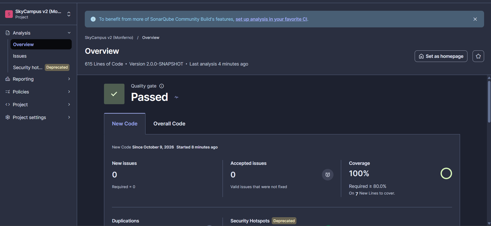

# 14 · SonarQube — Análisis estático de calidad (Monferno)

Se analiza **la v2 completa** ([`skycampus-v2`](../skycampus-v2)): 23 clases de producción, 615 líneas de código, Java y XML, con los patrones Strategy (`EstrategiaAsignacion` y sus 4 implementaciones, `PoliticaAsignacion`) y Observer (`GestorFlota`, `ObservadorDrone` y sus 3 suscriptores).

## Cómo se ejecuta

1. Levantar SonarQube Community Build (v26.9) en Docker: `docker start sonarqube` → `http://localhost:9000`.
2. Generar un *Global Analysis Token* y guardarlo **solo** en la variable de entorno `SONAR_TOKEN`, nunca en el repositorio.
3. Desde `Monferno\skycampus-v2`, ejecutar `mvn clean verify sonar:sonar`. El build corre las 114 pruebas, genera el XML de JaCoCo y lo sube junto con el análisis. Proyecto: `skycampus-v2`, "SkyCampus v2 (Monferno)".

## Resultado final (commit `6769a21`)

| Criterio del reto | Meta | Resultado |
|---|---|---|
| Quality Gate | Verde | ✅ **Passed** |
| Bugs (confiabilidad) | 0 | ✅ 0 · A |
| Vulnerabilidades (seguridad) | 0 | ✅ 0 · A |
| Deuda técnica | ≤ 30 min | ✅ **0 min** |
| Code smells (mantenibilidad), incluidas las clases de Strategy y Observer | 0 | ✅ 0 · A |
| Cobertura | ≥ 85 % | ✅ **100 %** (212/212 líneas; JaCoCo: 60/60 ramas) |
| Duplicaciones | — | 0,0 % |
| Security Hotspots | — | 0 |

Capturas:
- [`Sonar_QualityGate.png`](Sonar_QualityGate.png): Overview con el Quality Gate *Passed*.
- [`Sonar_Proyectos_QG.png`](Sonar_Proyectos_QG.png): lista de proyectos, con la v2 y el MVP de Chimchar (`skycampus-tdd`) en *Passed*.
- Detalle Overall Code y lista de issues vacía: [`Sonar_Despues.png`](../13%20%C2%B7%20JaCoCo%20%E2%80%94%20Cobertura%20de%20c%C3%B3digo/Sonar_Despues.png) y [`Sonar_Issues_Despues.png`](../13%20%C2%B7%20JaCoCo%20%E2%80%94%20Cobertura%20de%20c%C3%B3digo/Sonar_Issues_Despues.png), en el reto 13.

### Sobre el Quality Gate y la meta del 85 %

El proyecto usa el Quality Gate por defecto, **"Sonar way"**. Sus condiciones se evalúan sobre el **código nuevo**:
- 0 issues nuevos;
- cobertura del código nuevo ≥ 80 %;
- duplicación ≤ 3 %;
- hotspots revisados.

La meta de Monferno (≥ 85 %) se verifica sobre el **código total**, donde la cobertura es del 100 %. La regla `check` de JaCoCo del `pom.xml` (80 % de líneas y 70 % de ramas) actúa como segunda puerta: si se incumple, el build falla antes de llegar a Sonar (evidencia en el reto 13).

**Límites aceptados, para leer bien el "Passed":**
- **El 85 % hoy es una medición, no un control.** Ni JaCoCo (80 %) ni "Sonar way" (80 % sobre código nuevo) fallarían si la cobertura total bajara, por ejemplo, al 82 %. Para que fuera un control, habría que crear en Sonar un Quality Gate propio para `skycampus-v2`, con cobertura total ≥ 85 % y confiabilidad y seguridad en A, o subir el mínimo de JaCoCo a 0.85.
- **El gate verde cubre poco código.** El análisis del "antes" fue el primero del proyecto, y "Sonar way" evalúa solo el código nuevo desde ahí: **7 líneas nuevas por cubrir** (`Sonar_QualityGate.png`). Por eso la prueba real de calidad son las cifras de **Overall Code** (0 issues, 100 %), no solo el sello "Passed".

## Antes y después

El detalle está en el reto 13.

| | Antes (`507a8bc`) | Después (`6769a21`) |
|---|---|---|
| Issues | 3: 1 de confiabilidad (Medium) y 2 de mantenibilidad (High e Info) | **0** |
| Deuda | 15 min | **0 min** |
| Confiabilidad | C | **A** |

La deuda técnica se calcula sumando el esfuerzo estimado de cada issue: 5 + 10 + 0 = 15 min antes (`Sonar_Issues_Antes.png`) y "0 effort" después (`Sonar_Issues_Despues.png`). No se capturó la vista *Measures › Maintainability*.

Los 3 issues estaban en `EstadisticasMisiones` (reto 01). El commit de las correcciones (`6769a21`) solo modifica ese archivo:
1. una duración calculada sin zona horaria;
2. un literal repetido 4 veces;
3. un falso `TODO`: el comentario decía "*Todo* con Streams".

**Las clases de Strategy y Observer no tuvieron ningún issue en ninguno de los dos análisis.** Los únicos 3 issues estaban en `EstadisticasMisiones`, el único archivo que cambió para eliminarlos.

**Sobre "corregir al menos 3 code smells"** (criterio de Chimchar): la v2 tenía solo 2 issues de mantenibilidad, uno de ellos un falso positivo, y 1 de confiabilidad. Se corrigieron los 3, pero no se fabricaron code smells para llegar a la cifra. Los retos 03, 04 y 12 ya habían exigido lo mismo que Sonar mira: métodos cortos (el más largo tiene 11 líneas), validación de entradas con mensajes en español, ningún `return null` (se usa `Optional`), constantes con nombre y ninguna excepción genérica lanzada a mano.

## Chimchar (MVP) frente a Monferno (v2)

| | Chimchar · `skycampus-tdd` | Monferno · `skycampus-v2` |
|---|---|---|
| Líneas de código | 152 | 615 |
| Pruebas | 24 | 114 |
| Issues antes de corregir | 4 (java:S1220) | 3 |
| Issues después | 0 | 0 |
| Cobertura | 100 % | 100 % |
| Quality Gate | Passed | Passed |

El código creció 4 veces y sumó dos patrones, y aun así terminó igual de limpio. Los issues de Monferno fueron de otro tipo: en Chimchar eran de estructura de paquetes; aquí son de lógica de tiempo y de duplicación, que es lo esperable al pasar de un validador a estadísticas con fechas.
